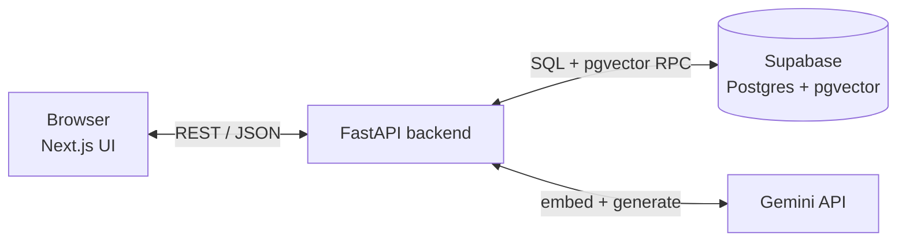
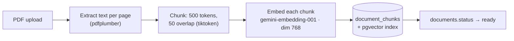
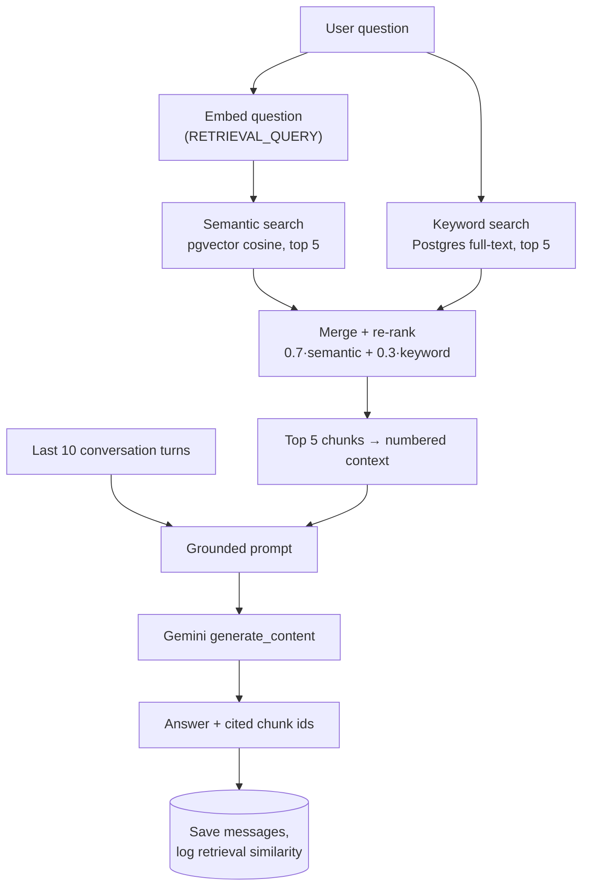

<p align="center">
  
</p>

<h1 align="center">Lumen</h1>
<p align="center"><b>Ask your PDFs anything. Every answer is grounded, cited, and scored — never hallucinated.</b></p>
<p align="center">FastAPI · Next.js 14 · Supabase (Postgres + pgvector) · Gemini</p>

---

## What it does

Upload a PDF, ask questions in plain language, get answers built **only** from the document's
own text — with inline citations `[1][2]`, page numbers, per-chunk similarity scores, and
multi-turn memory. Ask something the document doesn't cover and it says so instead of making
something up.

| | |
|---|---|
| **Document ingestion** | PDF → per-page extraction → 500-token chunks (50 overlap) → embeddings → pgvector |
| **Hybrid retrieval** | Semantic (cosine) + keyword (Postgres full-text), merged 70/30 |
| **Grounded generation** | Gemini answers only from retrieved chunks, cites them inline, refuses when unsupported |
| **Source transparency** | Every answer expands into the exact chunk, page number, and % match used |
| **Conversation memory** | Follow-ups resolve pronouns and build on prior grounded answers, per document |
| **Accounts** | Google sign-in (or email magic link) via Supabase Auth — every document, chat, and stat is scoped to the signed-in user, invisible to everyone else |

## Architecture



### Ingestion pipeline



Runs as a FastAPI `BackgroundTask` — the upload call returns a `document_id` immediately with
status `processing`; the frontend polls `/documents/{id}/status` every 2s.

### Query pipeline



## In action

<table>
<tr><td width="50%">

**Grounded, cited answer**


</td><td width="50%">

**Sources with similarity scores**


</td></tr>
<tr><td width="50%">

**Refuses when the document doesn't say**


</td><td width="50%">

**Upload + library sidebar**


</td></tr>
</table>

## Setup

**1. Supabase** — create a project, run [`backend/db/schema.sql`](backend/db/schema.sql) in the
SQL editor (creates all tables, the pgvector index, the `documents.user_id` column + RLS
policies, and the `match_document_chunks` / `keyword_search_document_chunks` RPC functions).
It's fully idempotent — safe to re-run any time you pull a schema change. From
**Project Settings → Data API → Project API keys**, copy the Project URL, the `service_role`
key (backend only, never expose it client-side), and the `anon`/`public` key (frontend).

**2. Auth (Google sign-in)** — Google is the primary sign-in option; email magic link works
out of the box with no extra setup as a fallback.
1. [Google Cloud Console](https://console.cloud.google.com) → **APIs & Services → Credentials**
   → **Create Credentials → OAuth client ID** → type **Web application**.
2. **Authorized JavaScript origins**: `http://localhost:3000` and your deployed frontend URL.
3. **Authorized redirect URIs**: `https://<your-project-ref>.supabase.co/auth/v1/callback`.
4. Copy the **Client ID** and **Client Secret**.
5. Supabase Dashboard → **Authentication → Providers → Google** → enable it, paste both values.

**3. Gemini** — grab an API key from Google AI Studio.

**4. Backend**
```bash
cd backend
python3 -m venv venv && source venv/bin/activate
pip install -r requirements.txt
cp .env.example .env   # SUPABASE_URL, SUPABASE_KEY, GEMINI_API_KEY
uvicorn app.main:app --reload --port 8000
```
Check: `curl localhost:8000/health` → `{"status":"ok"}`. Docs at `localhost:8000/docs`.

**5. Frontend**
```bash
cd frontend
npm install
cp .env.example .env.local   # NEXT_PUBLIC_API_URL, NEXT_PUBLIC_SUPABASE_URL, NEXT_PUBLIC_SUPABASE_ANON_KEY
npm run dev                  # localhost:3000
```
The anon key is safe to expose client-side by design — it's what RLS exists to constrain.

**6. Seed a demo document before presenting** — don't live-upload, processing time is
unpredictable on stage. Sign in via the app once first so the account exists, then:
```bash
cd backend && source venv/bin/activate
python scripts/seed_document.py /path/to/sample.pdf you@example.com
```
Runs the real ingestion pipeline offline and assigns the document to that account, so it's
already `ready` in your library when the app opens.

> Gemini model names churn fast — `text-embedding-004` and `gemini-2.0-flash` (the PRD's
> original picks) are already retired/quota-zero on new keys. Every model name lives in one
> place, [`backend/app/config.py`](backend/app/config.py), so swapping is a one-line change.
> Currently: `gemini-embedding-001` (768-dim) + `gemini-flash-lite-latest`.

## Deploying the backend (Render)

[`render.yaml`](render.yaml) at the repo root is a Render [Blueprint](https://render.com/docs/blueprint-spec) —
it builds `backend/` as a standalone Python web service.

1. Push this repo to GitHub (already done if you're reading this from there).
2. In the Render dashboard: **New → Blueprint**, connect the repo. Render reads `render.yaml`
   and provisions the `lumen-backend` web service automatically.
3. Set the secrets it can't infer from the file (`sync: false` means "you set this manually"):
   `SUPABASE_URL`, `SUPABASE_KEY`, `GEMINI_API_KEY`, and `CORS_ORIGINS` (your deployed frontend's
   origin, e.g. `https://your-app.vercel.app` — comma-separate multiple origins).
4. Once live, run `backend/db/schema.sql` against that same Supabase project if you haven't
   already, and point your frontend's `NEXT_PUBLIC_API_URL` at the Render service URL.

The free plan spins down on idle — the first request after inactivity takes ~30-60s to wake up.
Fine for a demo, not for anything latency-sensitive.

**Deploying the frontend** (e.g. Vercel): set root directory to `frontend`, add
`NEXT_PUBLIC_API_URL` (your Render URL), `NEXT_PUBLIC_SUPABASE_URL`, and
`NEXT_PUBLIC_SUPABASE_ANON_KEY`. Once you have the deployed frontend URL, add it to both
`CORS_ORIGINS` on Render and **Authorized JavaScript origins** on the Google OAuth client —
Google sign-in silently fails from an origin it doesn't recognize.

## API

Every endpoint except `/health` requires `Authorization: Bearer <supabase-access-token>` and is
scoped to that token's user — `/documents` never returns another user's documents, and
`/chat/{id}/messages` 404s (not 403, to avoid confirming another user's conversation exists)
if the conversation's document isn't yours.

| Method | Path | Purpose |
|---|---|---|
| `POST` | `/documents/upload` | Upload a PDF, kicks off background ingestion |
| `GET` | `/documents/{id}/status` | Poll ingestion status (`processing`/`ready`/`failed`) |
| `GET` | `/documents` | List your documents |
| `DELETE` | `/documents/{id}` | Delete a document (cascades to its chunks/conversations) |
| `POST` | `/chat` | Ask a question, get a grounded answer + sources |
| `GET` | `/chat/{conversation_id}/messages` | Full message history for a conversation |
| `GET` | `/stats` | Your document/chunk counts, avg retrieval similarity (last 10 queries) |
| `GET` | `/health` | Liveness check (no auth) |

## Design decisions

- **500-token chunks, 50 overlap** — balances context completeness against retrieval precision.
  Bigger chunks dilute the similarity signal; smaller ones lose context needed to answer well.
- **Hybrid search, 70/30** — semantic catches paraphrase and meaning, keyword catches exact
  terms/numbers embeddings blur past. Semantic weighted higher since it generalizes better.
- **Similarity scores surfaced in the UI** — transparency over blind trust; this is the
  retrieval-quality story.
- **Grounded but not verbatim-only generation** — the prompt lets Gemini *synthesize and draft*
  from retrieved context (e.g. "write this email using what the document describes"), not just
  quote it, while still refusing when the context doesn't support the ask. An earlier, stricter
  version of this prompt caused real false refusals on legitimate drafting questions during
  testing — see [`generation.py`](backend/app/services/generation.py) for the fix.
- **RAG over fine-tuning** — no retraining to add documents, cheaper, and every answer is
  auditable back to source text.
- **Per-document scope** — v1 filters retrieval by `document_id`. Cross-document retrieval would
  mean a soft multi-select filter or dropping the filter and re-ranking globally.
- **Isolation enforced in FastAPI, not Postgres RLS** — the backend uses Supabase's
  `service_role` key, which bypasses RLS by design, so every query is explicitly filtered by
  the authenticated user's id in `db.py`/routers. RLS policies exist too, purely as a second
  layer in case anything ever queries Supabase directly with the `anon` key.
- **Google-first auth, not Google-only** — email magic link works with zero extra setup as a
  fallback; Google needs a one-time OAuth client created in Google Cloud Console (see Setup).

## Known limitations

- No per-user rate limiting or usage caps yet — one account can still exhaust the shared
  Gemini quota for everyone. Natural next step now that requests carry a `user_id`.
- No formal retrieval eval set (e.g. RAGAS) — judged by similarity threshold + spot-checks.
- Scanned/image-only PDFs fail extraction (no OCR).
- Retrieval and memory are per-document, not cross-document.
- Free-tier Gemini quota is small and model availability shifts — see the note in Setup.
- Free Render plan spins down on idle (~30-60s cold start on the first request).

## Project structure

```
backend/app/
  main.py                 FastAPI app, CORS, router registration
  config.py                model names, chunk sizes, search weights
  db.py                     Supabase client + all query helpers (every query user_id-scoped)
  auth.py                   FastAPI dependency validating the Supabase session token
  routers/                  documents.py · chat.py · stats.py
  services/
    ingestion.py             extract → chunk → embed → store
    retrieval.py              embed_query, semantic/keyword/hybrid search
    generation.py              prompt construction + Gemini call
    gemini_client.py            shared genai.configure()
  models/schemas.py         Pydantic request/response models
backend/db/schema.sql     run once in Supabase SQL editor (idempotent)
backend/scripts/seed_document.py   pre-process a demo PDF offline, owned by a real account

frontend/app/page.tsx    top-level layout, gates on auth (LoginScreen vs. the app)
frontend/components/       Sidebar · UploadZone · ChatPanel · MessageBubble · LoginScreen ·
                             AnswerContent · SourceList · SimilarityBadge · StatsBar
frontend/lib/
  api.ts, types.ts          typed API client, attaches the Supabase access token to every call
  supabaseClient.ts          browser Supabase client (uses the anon key)
  AuthProvider.tsx            session/user context, Google + magic-link sign-in
```

## Demo script

1. Open with a pre-seeded document — no live upload.
2. Ask a factual question → point at the retrieved chunks and similarity scores first.
3. Ask a follow-up that depends on the prior turn → show conversation memory working.
4. Ask something outside the document → show the refusal, not a hallucination.
5. Walk through: chunking strategy, why hybrid search, why scores are shown.

## Contributing

Issues and PRs are welcome.

1. Fork the repo, branch off `main`.
2. Follow the existing structure — routers stay thin, business logic lives in `services/`.
3. Run the backend (`uvicorn app.main:app --reload`) and frontend (`npm run dev`) locally and
   verify your change end-to-end before opening a PR — a change to ingestion, retrieval, or
   generation is only proven by actually asking a question and checking the answer.
4. Keep PRs scoped to one change; explain the *why* in the description, not just the *what*.

## Credits

<p align="center">Made with 🩶 by <a href="https://github.com/het2576">@het2576</a></p>
