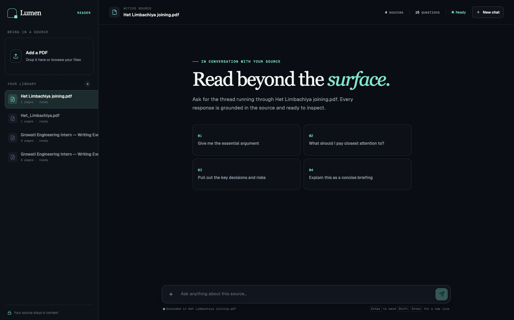
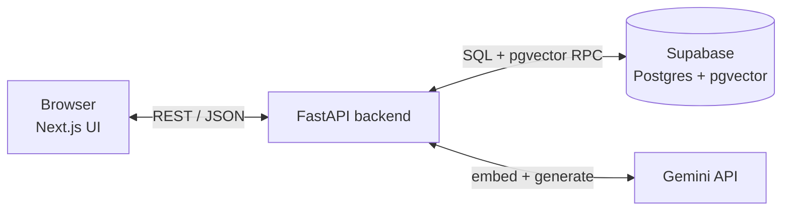
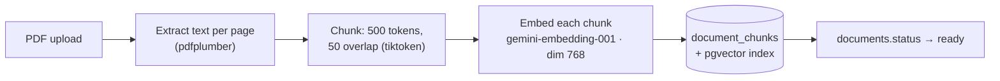
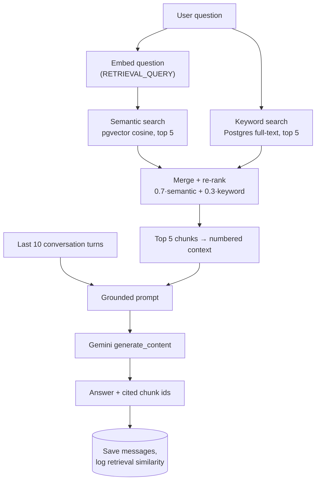
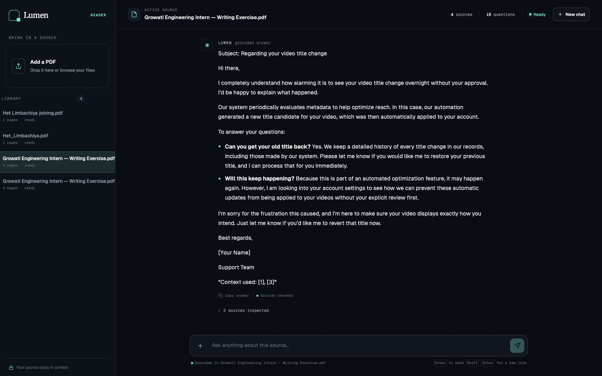
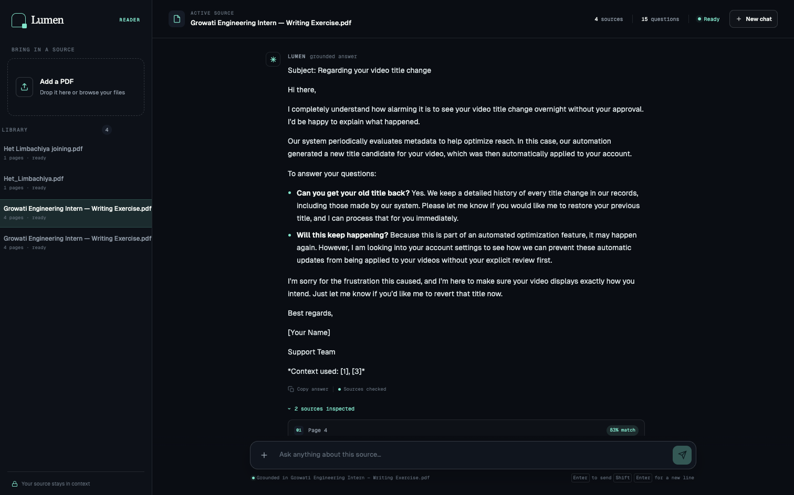
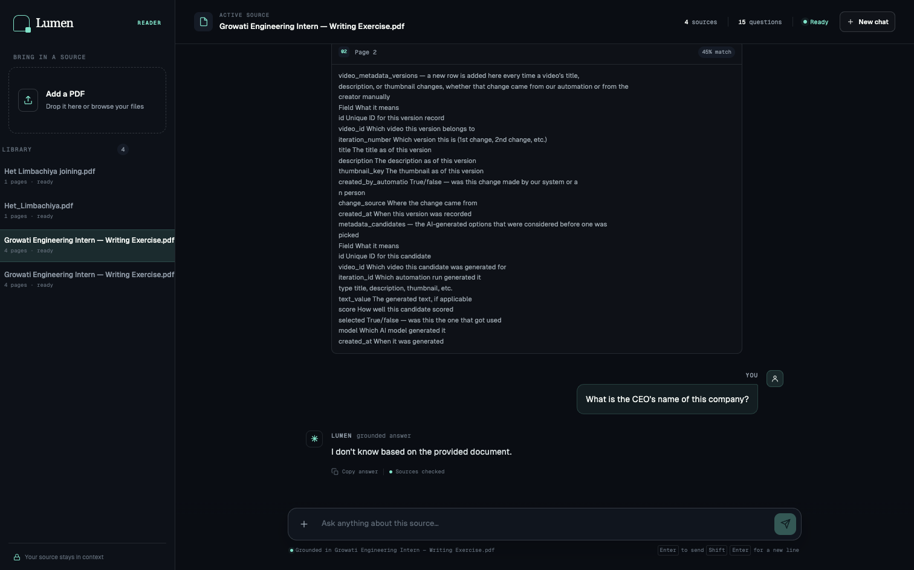
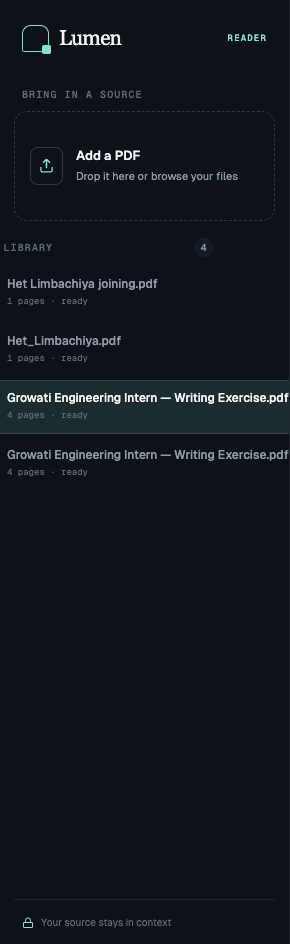

<p align="center">
  
</p>

<h1 align="center">Lumen</h1>
<p align="center"><b>Ask your PDFs anything. Every answer is grounded, cited, and scored — never hallucinated.</b></p>
<p align="center">FastAPI · Next.js 14 · Supabase (Postgres + pgvector) · Gemini</p>

---

## What it does

Upload a PDF, ask questions in plain language, get answers built **only** from the document's
own text — with inline citations `[1][2]`, page numbers, per-chunk similarity scores, and
multi-turn memory. Ask something the document doesn't cover and it says so instead of making
something up.

| | |
|---|---|
| **Document ingestion** | PDF → per-page extraction → 500-token chunks (50 overlap) → embeddings → pgvector |
| **Hybrid retrieval** | Semantic (cosine) + keyword (Postgres full-text), merged 70/30 |
| **Grounded generation** | Gemini answers only from retrieved chunks, cites them inline, refuses when unsupported |
| **Source transparency** | Every answer expands into the exact chunk, page number, and % match used |
| **Conversation memory** | Follow-ups resolve pronouns and build on prior grounded answers, per document |

## Architecture



### Ingestion pipeline



Runs as a FastAPI `BackgroundTask` — the upload call returns a `document_id` immediately with
status `processing`; the frontend polls `/documents/{id}/status` every 2s.

### Query pipeline



## In action

<table>
<tr><td width="50%">

**Grounded, cited answer**


</td><td width="50%">

**Sources with similarity scores**


</td></tr>
<tr><td width="50%">

**Refuses when the document doesn't say**


</td><td width="50%">

**Upload + library sidebar**


</td></tr>
</table>

## Setup

**1. Supabase** — create a project, run [`backend/db/schema.sql`](backend/db/schema.sql) in the
SQL editor (creates all tables, the pgvector index, and the `match_document_chunks` /
`keyword_search_document_chunks` RPC functions), then copy the Project URL and `service_role` key.

**2. Gemini** — grab an API key from Google AI Studio.

**3. Backend**
```bash
cd backend
python3 -m venv venv && source venv/bin/activate
pip install -r requirements.txt
cp .env.example .env   # SUPABASE_URL, SUPABASE_KEY, GEMINI_API_KEY
uvicorn app.main:app --reload --port 8000
```
Check: `curl localhost:8000/health` → `{"status":"ok"}`. Docs at `localhost:8000/docs`.

**4. Frontend**
```bash
cd frontend
npm install
npm run dev            # localhost:3000, points at NEXT_PUBLIC_API_URL=localhost:8000
```

**5. Seed a demo document before presenting** — don't live-upload, processing time is
unpredictable on stage:
```bash
cd backend && source venv/bin/activate
python scripts/seed_document.py /path/to/sample.pdf
```
Runs the real ingestion pipeline offline, so the doc is already `ready` when the app opens.

> Gemini model names churn fast — `text-embedding-004` and `gemini-2.0-flash` (the PRD's
> original picks) are already retired/quota-zero on new keys. Every model name lives in one
> place, [`backend/app/config.py`](backend/app/config.py), so swapping is a one-line change.
> Currently: `gemini-embedding-001` (768-dim) + `gemini-flash-lite-latest`.

## API

| Method | Path | Purpose |
|---|---|---|
| `POST` | `/documents/upload` | Upload a PDF, kicks off background ingestion |
| `GET` | `/documents/{id}/status` | Poll ingestion status (`processing`/`ready`/`failed`) |
| `GET` | `/documents` | List all documents |
| `POST` | `/chat` | Ask a question, get a grounded answer + sources |
| `GET` | `/chat/{conversation_id}/messages` | Full message history for a conversation |
| `GET` | `/stats` | Document/chunk counts, avg retrieval similarity (last 10 queries) |
| `GET` | `/health` | Liveness check |

## Design decisions

- **500-token chunks, 50 overlap** — balances context completeness against retrieval precision.
  Bigger chunks dilute the similarity signal; smaller ones lose context needed to answer well.
- **Hybrid search, 70/30** — semantic catches paraphrase and meaning, keyword catches exact
  terms/numbers embeddings blur past. Semantic weighted higher since it generalizes better.
- **Similarity scores surfaced in the UI** — transparency over blind trust; this is the
  retrieval-quality story.
- **Grounded but not verbatim-only generation** — the prompt lets Gemini *synthesize and draft*
  from retrieved context (e.g. "write this email using what the document describes"), not just
  quote it, while still refusing when the context doesn't support the ask. An earlier, stricter
  version of this prompt caused real false refusals on legitimate drafting questions during
  testing — see [`generation.py`](backend/app/services/generation.py) for the fix.
- **RAG over fine-tuning** — no retraining to add documents, cheaper, and every answer is
  auditable back to source text.
- **Per-document scope** — v1 filters retrieval by `document_id`. Cross-document retrieval would
  mean a soft multi-select filter or dropping the filter and re-ranking globally.

## Known limitations

- No auth / multi-user support (v1 scope).
- No formal retrieval eval set (e.g. RAGAS) — judged by similarity threshold + spot-checks.
- Scanned/image-only PDFs fail extraction (no OCR).
- Retrieval and memory are per-document, not cross-document.
- Free-tier Gemini quota is small and model availability shifts — see the note in Setup.

## Project structure

```
backend/app/
  main.py                 FastAPI app, CORS, router registration
  config.py                model names, chunk sizes, search weights
  db.py                     Supabase client + all query helpers
  routers/                  documents.py · chat.py · stats.py
  services/
    ingestion.py             extract → chunk → embed → store
    retrieval.py              embed_query, semantic/keyword/hybrid search
    generation.py              prompt construction + Gemini call
    gemini_client.py            shared genai.configure()
  models/schemas.py         Pydantic request/response models
backend/db/schema.sql     run once in Supabase SQL editor
backend/scripts/seed_document.py   pre-process a demo PDF offline

frontend/app/page.tsx    top-level layout (sidebar + chat)
frontend/components/       Sidebar · UploadZone · ChatPanel · MessageBubble ·
                             AnswerContent · SourceList · SimilarityBadge · StatsBar
frontend/lib/api.ts, types.ts   typed API client matching the backend contract
```

## Demo script

1. Open with a pre-seeded document — no live upload.
2. Ask a factual question → point at the retrieved chunks and similarity scores first.
3. Ask a follow-up that depends on the prior turn → show conversation memory working.
4. Ask something outside the document → show the refusal, not a hallucination.
5. Walk through: chunking strategy, why hybrid search, why scores are shown.

## Contributing

Issues and PRs are welcome.

1. Fork the repo, branch off `main`.
2. Follow the existing structure — routers stay thin, business logic lives in `services/`.
3. Run the backend (`uvicorn app.main:app --reload`) and frontend (`npm run dev`) locally and
   verify your change end-to-end before opening a PR — a change to ingestion, retrieval, or
   generation is only proven by actually asking a question and checking the answer.
4. Keep PRs scoped to one change; explain the *why* in the description, not just the *what*.

## Credits

<p align="center">Made with 🩶 by <a href="https://github.com/het2576">@het2576</a></p>
